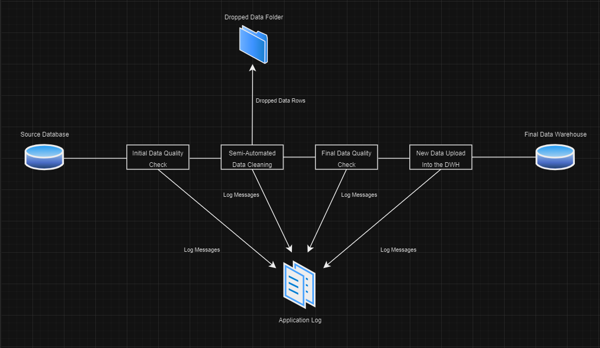

## Subscriber Cancellation Pipeline

This project was completed as a part of the data engineering course on codecademy and aims to build a semi-automatic data pipeline in Python automated by a Bash script. 

### Executive Summary

In this project, there is a sqlite3 database of long-term cancelled subscribers to an online coding website called cademycode. This database includes personal information about the cancelled subscribers, their job and the career path they were enrolled in. 

The pipeline that is being built connects to the database, fetches the data, cleans and transforms it and uploads it into a sqlite3 data warehouse for analysis. The design of the warehouse is also a part of the project. The data itself is not analysed. 

### Detailed Pipeline Description

There are three tables in the database:
    students - includes information about the students who cancelled their subscription
    jobs - includes information about the jobs students had
    paths - includes information about the study paths the students were enrolled in 

#### Folder Structure:

databases - This includes the source database. Two sqlite3 files are included. Cademycode_updated includes 1000 more cancelled subscribers than cademycode and is used to check the functionality of the pipeline in question. The folder also includes a script for viewing the individual databases. 
dev - This includes all of the data manipulation and cleaning scripts. 
dropped_data_log - This includes files with dropped data. 
prod - This includes the final data warehouse, a script that was used to create it and a script that views it.
script.sh - This is a bash script that automates the execution of the python scripts in the dev folder. 
Data Warehouse Diagram - Includes a diagram of the data warehouse.
Database Diagram - Includes a diagram of the initial database.

#### Process:

1. Run script.sh, do not run the python scripts individually 
2. During the execution of the python scripts, various information gets logged into application_log.log file.
3. The initial_data_quality_test.py runs tests that check the format of the tables, this includes checks for: The right columns in all of the tables, whether or not the columns have headers and if the tables are corrupted with non-standard strings indicating an empty value. This is just a very rough data quality check designed to catch errors that would cause the following scripts to crash. 
4. The students_automated_cleaning.py, jobs_automated_cleaning.py and paths_automated_cleaning.py scripts are then run. These scripts clean and manipulate the data and run functions that help users deal with missing data. User input is needed at this stage. Any rows that are dropped are stored in an individual file for possible later analysis. Each script creates a temporary .csv file containing the cleaned records. 
5. Final data quality tests are then run which test for referential integrity and run tests on every column to ensure that no corrupted values are present. 
6. The .csv files containing the cleaned data are compared with the values in the warehouse. New cancellations are added and any changes in the dimension tables paths_dim and jobs_dim are reflected. More info on the design of the data warehouse is given below. 

#### Data Warehouse Description:

The data warehouse being designed follows a simple star-schema structure, with a cancellations fact table and associated students, jobs and paths dimension tables. The fact table is a factless fact table and the grain of the fact table is a specific student cancelling his/her subscription.
The students dimension never changes, therefore it is considered to be SCD of type 0, the paths and jobs dimensions can change (curriculum gets updated and job categories and the corresponding salaries change), therefore these dimensions are designed as SCD type 2 with row_effective_date, row_expiration_date and current_row_indicator columns added to reflect this. 

The Warehouse structure is shown below

#### Source Database Diagram

This diagram shows the structure of the source database

